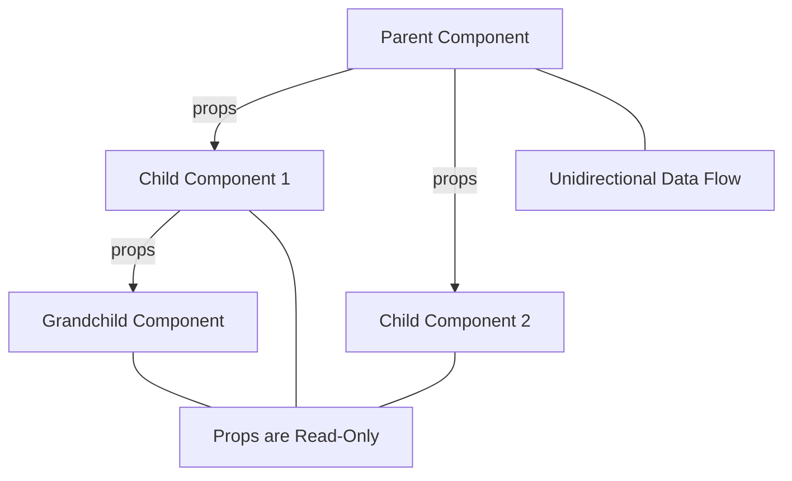

## FlowChart

This diagram shows:

- Props being passed from a parent component to its children
- The unidirectional flow of data (top-down)
- The read-only nature of props in child components

    

