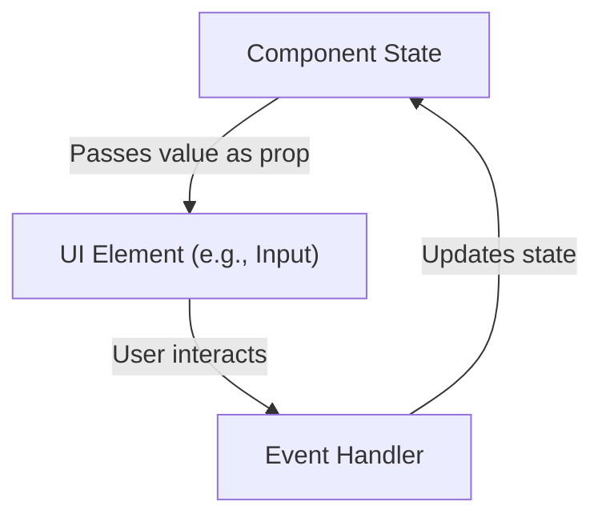

## FlowChart

    

```mermaid
graph TD
    A["Component State"] -->|"Passes value as prop"| B["UI Element (e.g., Input)"]
    B -->|"User interacts"| C["Event Handler"]
    C -->|"Updates state"| A

```